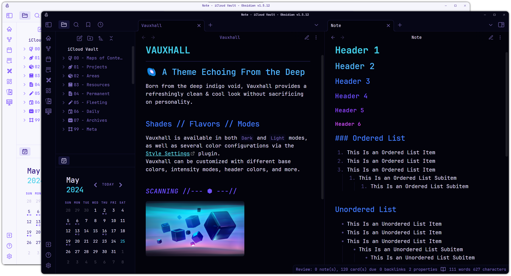
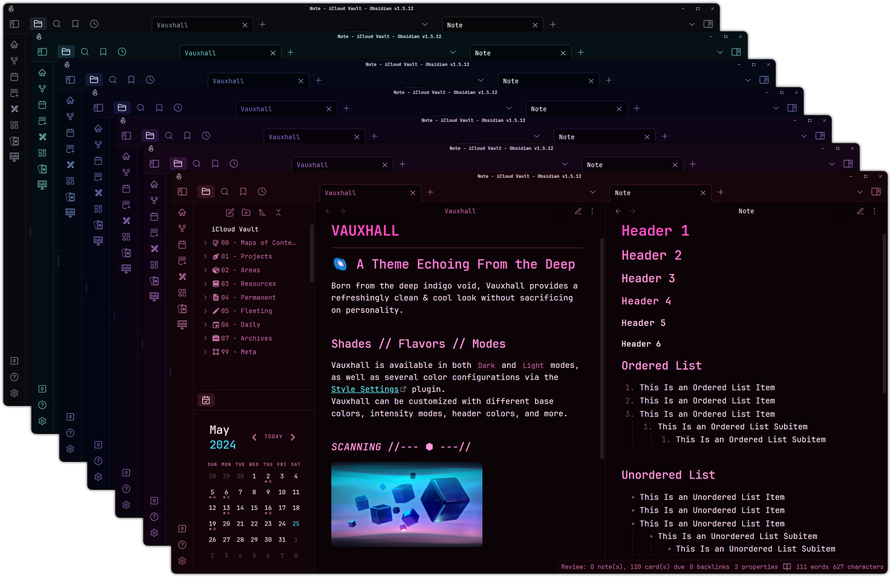
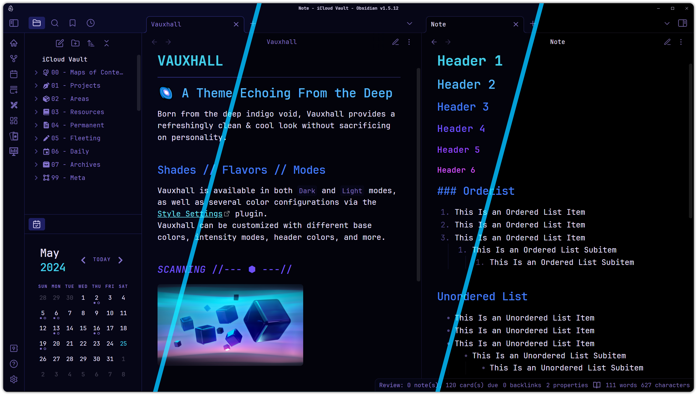
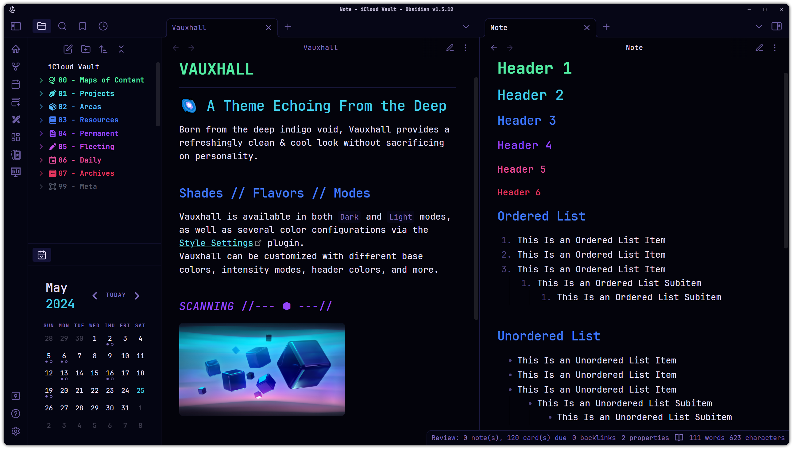

# 🌌 Vauxhall (for Obsidian)

Vauxhall provides a refreshingly clean & cool look without sacrificing personality. With the [Style Settings](https://github.com/mgmeyers/obsidian-style-settings) plugin, Vauxhall can be customized with different base colors, intensity modes, header colors, & more.

  

## Recommendations ⭐

- [Style Settings](https://github.com/mgmeyers/obsidian-style-settings) Plugin
  - Required for all customization described below, minus the default dark & light themes.

## Pairings 🍷

- [JetBrains Mono](https://www.jetbrains.com/lp/mono/) Font
- [Iconize](https://github.com/FlorianWoelki/obsidian-iconize) Plugin
- [Colored Sidebar](https://github.com/CyanVoxel/Obsidian-Colored-Sidebar) Snippet

## Color Variations

Choose between several different base color variations, including:

- White, Teal, Blue, **Indigo** `(Default)`, Purple, Magenta, & Red

## Intensities

Choose between 3 different background color intensities:

- Nebula
- **Standard** `(Default)`
- Void

## Header Colors & More

Choose between several header color styles, including:

- Mono
- Mono Gradient
- Rainbow
- Gradient (Mint/Blue)
- **Gradient (Cyan/Purple)** `(Default)`
- Gradient (Blue/Red)

_Pictured: "Rainbow"_
